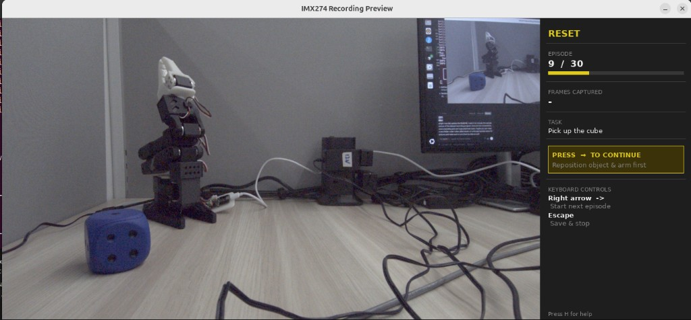

# HSB + GR00T Robot Control

Runs the NVIDIA Holoscan Sensor Bridge (HSB) IMX274 camera through a GPU
pipeline, feeds frames to a GR00T N1.6 policy server to control an SO-101
robot arm, and records LeRobot-compatible datasets for training.

---

## Repository layout

```
hsb-groot-robot/
├── run.sh                     Docker launcher (mounts, env vars, PYTHONPATH)
├── install_robot_deps.sh      One-time pip install inside the container
├── README.md
│
├── pipeline/                  Holoscan camera pipeline scripts (run inside Docker)
│   ├── linux_imx274_player.py       Main inference + teleop pipeline
│   ├── imx274_zmq_server.py         ZMQ camera publisher (for dataset recording)
│   ├── linux_imx274_player_v4l2_sink.py  Legacy v4l2 bridge (reference only)
│   └── example_configuration.yaml  Holoscan YAML config
│
├── recording/                 Dataset recording scripts (run on host)
│   └── imx274_lerobot_record.py     LeRobot dataset recorder (ZMQ camera input)
│
├── payload/                   HSB payload transmission experiments
│   ├── thor_send_payload.py
│   ├── thor_send_payload_with_ecb.py
│   └── test_udp_listener.py
│
├── payload_generator_op/      Custom C++ Holoscan operator (GPU tensor emitter)
│   ├── CMakeLists.txt
│   ├── build.sh
│   ├── payload_generator_op.{hpp,cpp}
│   └── payload_generator_op_pybind.cpp
│
├── references/                Upstream reference scripts
│   └── lerobot_record.py
│
├── notes/                     Session notes, organised by date
│   ├── assets/
│   │   └── 2026-04-16/        Screenshots and images from that session
│   ├── 2026-04-16/
│   │   ├── hsb-udp-payload-sender-debugging.md
│   │   ├── zmq-recording-pipeline-and-dataset-setup.md
│   │   └── reset-phase-and-gui-panel-improvements.md
│   └── 2026-04-18/
│       └── recording-preview-window-and-ux-improvements.md
│
└── logs/                      Runtime log output (gitignored)
```

---

## How the inference pipeline works

```
IMX274 camera (ethernet, 192.168.0.2)
  └─ LinuxReceiverOp        reassembles UDP packets into one raw frame
      └─ CsiToBayerOp       raw CSI  →  Bayer uint16  (GPU)
          └─ ImageProcessorOp   optical black subtraction, white balance
              └─ BayerDemosaicOp    Bayer  →  RGBA uint16  (GPU)
                  ├─ HolovizOp "holoviz"
                  │       hardware sRGB curve at scanout  →  display window
                  │       (always on)
                  │
                  ├─ SrgbConvertOp          [only with --preview]
                  │       drops alpha, applies sRGB in CuPy, emits RGB uint8
                  │       stays 100% on GPU — no CPU copy
                  │   ├─ HolovizOp "preview"
                  │   │       shows exactly what GR00T receives
                  │   └─ PolicyClientOp     [robot mode + --preview]
                  │           skips its own conversion (uint8 detected)
                  │
                  └─ PolicyClientOp         [robot mode, no --preview]
                          applies sRGB inline, reads joint state from SO-101,
                          sends frame + state to GR00T server over ZMQ,
                          receives 16-step action chunk
                      └─ RobotActionOp
                              writes Goal_Position to SO-101 servos via serial
                              optionally logs predicted / actual positions to CSV
```

---

## How the dataset recording pipeline works

```
Docker container                         Host
────────────────                         ────
imx274_zmq_server.py                     imx274_lerobot_record.py
  LinuxReceiverOp                          ZMQCamera
    CsiToBayerOp                             ↑ JPEG over ZMQ (port 5556)
      ImageProcessorOp             FeetechMotorsBus (follower, USB)
        BayerDemosaicOp            FeetechMotorsBus (leader,   USB) ← optional
          SrgbConvertOp                LeRobotDataset.add_frame()
            ZmqPublisherOp ──────→       └─ Parquet + video (LeRobot v2)
```

No v4l2loopback, no YUYV422 conversion, no lag — the RGB uint8 CuPy
tensor from `SrgbConvertOp` is JPEG-encoded on the GPU and sent directly
over ZMQ to the recording script on the host.

---

## Setup (one-time)

### 1 — Start the GR00T policy server (host, outside Docker)

> Only needed for inference (`linux_imx274_player.py`), not for recording.

```bash
cd ~/Isaac-GR00T
LD_LIBRARY_PATH=/home/latticeapp/Isaac-GR00T/.venv/lib/python3.12/site-packages/nvidia/cu13/lib:${LD_LIBRARY_PATH:-} \
uv run python -m gr00t.eval.run_gr00t_server \
    --model_path ~/groot-so101-finetune/model --port 5555
```

Wait for `Server listening on port 5555` before running the player.

> Uses `uv run` (not conda) because only the `Isaac-GR00T/.venv` has the
> correct pinned GR00T deps and the CUDA DSS library.

### 2 — Launch the Docker container (host)

```bash
xhost +          # allow X11 from Docker (once per session)
cd ~/hsb-groot-robot
./run.sh
```

`run.sh` mounts `$HOME`, `/dev`, the X11 socket, and sets `PYTHONPATH` so
`import holoscan` and `import gr00t` work inside the container.

### 3 — Install robot dependencies (inside container, first run only)

```bash
./run.sh bash install_robot_deps.sh
```

Installs `pyzmq`, `msgpack`, `pyserial`, `feetech-servo-sdk`, `lerobot`
(editable), and `opencv-python-headless`.

Packages are written to `~/.docker-packages` — a folder on the **host**
that is bind-mounted into every container. This means the install survives
container restarts; you only need to run this once (or when you want to
update a package). `run.sh` adds `~/.docker-packages` to `PYTHONPATH`
automatically.

> **Note:** pip will print dependency-conflict warnings about `gr00t`
> (torch, transformers, etc. not installed in the container). These are
> harmless — `gr00t` is used on the host, not inside Docker.

---

## Inference — linux_imx274_player.py

> Run inside Docker via `./run.sh python pipeline/linux_imx274_player.py ...`

### Camera only — no robot

```bash
python pipeline/linux_imx274_player.py --camera-mode 1 --no-robot
```

### Camera + preview window (see exactly what GR00T receives)

```bash
python pipeline/linux_imx274_player.py --camera-mode 1 --no-robot --preview --exposure 0.3
```

Opens two windows: the raw demosaiced feed and the sRGB uint8 frame the model sees.

### Full pipeline — camera + GR00T + robot arm

```bash
python pipeline/linux_imx274_player.py \
    --camera-mode 1 \
    --policy-host localhost \
    --policy-port 5555 \
    --lang-instruction "Move the blue dice" \
    --exposure 0.3
```

### Full pipeline with preview + CSV logging

```bash
python pipeline/linux_imx274_player.py \
    --camera-mode 1 \
    --lang-instruction "Move the blue dice" \
    --exposure 0.3 \
    --preview \
    --action-log /home/latticeapp/actions.csv \
    --sent-log /home/latticeapp/sent_commands.csv
```

CSV files land in `$HOME` which is bind-mounted, so they persist after the container exits.

### Arguments — linux_imx274_player.py

#### Camera

| Argument | Default | Description |
|---|---|---|
| `--camera-mode` | `0` | Resolution mode. `0` = 4K, `1` = 1080p, `2` = 4K alt. |
| `--hololink` | `192.168.0.2` | IP address of the HSB board. |
| `--expander-configuration` | `0` | I2C expander config (`0` or `1`). |
| `--pattern` | off | Display a built-in test pattern (0–11) instead of live camera. |

#### Display

| Argument | Default | Description |
|---|---|---|
| `--headless` | off | Run without any display window. |
| `--fullscreen` | off | Open the Holoviz window in fullscreen. |
| `--preview` | off | Open a second window showing the exact RGB uint8 frame sent to GR00T. Runs `SrgbConvertOp` on GPU — no extra CPU copy. |
| `--exposure` | `0.3` | Linear brightness multiplier applied before the sRGB curve. |

#### Robot control

| Argument | Default | Description |
|---|---|---|
| `--no-robot` | off | Skip all robot and policy code. Camera and display only. |
| `--robot-port` | `/dev/ttyACM0` | Serial port for the SO-101 follower arm. |
| `--robot-id` | `my_awesome_follower_arm` | Calibration ID — must match the filename in `~/.cache/huggingface/lerobot/calibration/robots/so_follower/`. |
| `--policy-host` | `localhost` | Hostname where the GR00T policy server is running. |
| `--policy-port` | `5555` | ZMQ port of the GR00T policy server. |
| `--action-horizon` | `8` | Steps to execute from each inference chunk before requesting a new one. |
| `--lang-instruction` | `"Move the blue dice"` | Natural language task description sent to the model. |

#### Logging

| Argument | Default | Description |
|---|---|---|
| `--action-log` | off | CSV path. Logs predicted joint goal positions before each `sync_write`. |
| `--sent-log` | off | CSV path. Logs sent commands + present positions read back after each `sync_write`. |
| `--frame-limit` | off | Exit after N frames. Useful for quick tests. |
| `--log-level` | `20` | Python logging level. `10` = DEBUG, `20` = INFO, `30` = WARNING. |

---

## Dataset recording

Recording uses two separate processes — one inside Docker (camera), one on the host (dataset writer).

### Step 1 — Start the ZMQ camera server (inside Docker)

```bash
./run.sh python pipeline/imx274_zmq_server.py --camera-mode 1 --headless
```

This runs the full IMX274 → `SrgbConvertOp` pipeline and publishes every
RGB uint8 frame as a JPEG over ZMQ on port 5556. No robot arm is needed here.

### Step 2 — Start the recorder (host, new terminal)

```bash
conda activate lerobot2
python recording/imx274_lerobot_record.py \
    --follower-port /dev/ttyACM0 \
    --follower-id my_awesome_follower_arm \
    --leader-port /dev/ttyACM1 \
    --leader-id my_leader \
    --no-push
```

The script opens an **interactive menu** to choose which experiment dataset to
record into (control blue-only or mixed 80/20). Dataset names, repo IDs, scene
setup instructions, and episode targets are all pre-configured in the script.
It then asks how many episodes to record in this session.

Pass `--dataset 1` or `--dataset 2` to skip the menu entirely.

Omit `--leader-port` to record without teleoperation (follower holds its
position, action = state).

#### Live preview window

A preview window opens automatically showing the live camera feed alongside a
side panel with real-time recording status. Pass `--no-preview` to disable it.

| Recording state | Reset state |
|---|---|
|  |  |

The side panel shows the current phase (RECORDING / RESET), episode progress,
frame count, task description, and keyboard shortcuts. During reset the panel
shows a highlighted prompt reminding you to press `→` when ready.

#### Arm torque modes

| Arm | Torque | Why |
|---|---|---|
| **Leader** (teleop) | OFF — compliant | You move it freely with your hand |
| **Follower** | ON — position hold | Tracks the leader; holds position at rest |

The follower reads its current position before enabling torque so it does not
jump when recording starts.

#### Starting fresh vs. resuming

When the recorder starts, if the target dataset folder already exists and
`--resume` was not passed, the script prompts interactively:

```
  ⚠  Dataset folder already exists: datasets/control_blue_only
     Contains 9 recorded episode(s).
  [d]  Delete it and start a fresh recording session
  [r]  Resume — keep existing episodes and continue recording
  [q]  Quit
```

To skip the prompt you can either pass `--resume` directly or delete the folder
beforehand:

```bash
rm -rf datasets/control_blue_only   # start completely fresh
# or
python recording/imx274_lerobot_record.py ... --resume
```

When resuming, the episode counter starts from the number of already-saved
episodes and the script asks how many total episodes you want, defaulting to
the previous session's target.

### Keyboard controls during recording

| Key | Recording phase | Reset phase |
|---|---|---|
| Right arrow `→` | Save episode early and continue | Start the next episode |
| Left arrow `←` | Discard episode and re-record | — |
| Escape | Save episode and stop all recording | Stop all recording |
| H | Toggle full-screen help overlay | Toggle full-screen help overlay |

**The reset phase waits indefinitely.** After an episode finishes the script
pauses in RESET state until you explicitly press `→`. Use this time to
reposition the object and the robot arm. The preview panel displays a
highlighted `PRESS → TO CONTINUE` prompt as a reminder.

### Arguments — imx274_zmq_server.py

| Argument | Default | Description |
|---|---|---|
| `--camera-mode` | `0` | Same as main player. |
| `--hololink` | `192.168.0.2` | HSB board IP. |
| `--headless` | on | Run without display (default for server mode). |
| `--no-headless` | — | Show a preview window while streaming. |
| `--preview` | off | Open sRGB preview window (requires `--no-headless`). |
| `--zmq-port` | `5556` | ZMQ PUB port. Must match `--zmq-port` in the recorder. |
| `--camera-name` | `front` | Camera key in the ZMQ message. |
| `--jpeg-quality` | `90` | JPEG quality for ZMQ stream (1–100). |
| `--exposure` | `0.3` | Same as main player. |
| `--frame-limit` | off | Exit after N frames. |

### Arguments — imx274_lerobot_record.py

| Argument | Default | Description |
|---|---|---|
| `--dataset` | interactive | Skip the interactive menu and go straight to dataset `1` or `2`. |
| `--repo-id` | from config | Override the repo ID from the selected dataset config. |
| `--root` | from config | Override the local root directory for the dataset. |
| `--num-episodes` | interactive | Override the episode count (otherwise prompted interactively). |
| `--fps` | `30` | Target recording frame rate. |
| `--episode-time` | `30` | Seconds of data per episode. |
| `--vcodec` | `h264_nvenc` | Video codec. `h264_nvenc` uses Jetson hardware encoder. |
| `--zmq-host` | `localhost` | Host running `imx274_zmq_server.py`. |
| `--zmq-port` | `5556` | ZMQ port (must match server). |
| `--camera-name` | `front` | Camera name in the ZMQ stream. |
| `--follower-port` | `/dev/ttyACM0` | Serial port for SO-101 follower arm. |
| `--follower-id` | `my_follower` | Follower calibration ID. |
| `--calibration-dir` | `~/.cache/.../so_follower` | Directory with follower `<id>.json` calibration files. |
| `--leader-port` | off | Serial port for SO-101 leader arm (teleop). Omit to disable. |
| `--leader-id` | `my_leader` | Leader arm calibration ID. |
| `--no-push` | off | Skip pushing the finished dataset to Hugging Face Hub. |
| `--private` | off | Make the Hub repository private. |
| `--resume` | off | Resume recording into an existing dataset (skip the d/r/q prompt). |
| `--no-preview` | off | Disable the live camera preview window. |

---

## Camera modes

| `--camera-mode` | Resolution | Notes |
|---|---|---|
| `0` | 3840×2160 (4K) | Default |
| `1` | 1920×1080 (1080p) | Recommended for robot control and recording |
| `2` | 3840×2160 (4K alt) | |

---

## Troubleshooting

**`ModuleNotFoundError: No module named 'holoscan'`**
Exit the container and re-run `./run.sh`. The script sets `PYTHONPATH` automatically.

**`ModuleNotFoundError: No module named 'lerobot'` / `'cv2'` / `'zmq'`**
Run `./run.sh bash install_robot_deps.sh` once. Packages are saved to
`~/.docker-packages` on the host and persist between container restarts.

**`ModuleNotFoundError: No module named 'gr00t'`**
`run.sh` adds `~/Isaac-GR00T` to `PYTHONPATH`. Verify that directory exists on the host.

**`ModuleNotFoundError: No module named 'cupy'` when running the ZMQ server**
You ran `python pipeline/imx274_zmq_server.py` directly on the host. It must run
inside Docker where `cupy` and Holoscan are available:
```bash
./run.sh python pipeline/imx274_zmq_server.py --camera-mode 1 --headless
```

**ZMQ camera timeout / no frames received**
Ensure `imx274_zmq_server.py` is running **inside Docker** before starting the
recorder on the host. Check that port 5556 is not blocked. Try
`--zmq-host <jetson-ip>` if running the recorder on a different machine.

**`FileExistsError` when starting a new dataset**
The dataset folder already exists (e.g. from a previous session or a `.gitkeep`
placeholder). Either delete it to start fresh or pass `--resume`:
```bash
rm -rf datasets/control_blue_only
# or
python recording/imx274_lerobot_record.py ... --resume
```

**Both arms are stiff / locked during recording**
This happened when both arms were set up identically in position-control mode with
torque enabled. The leader arm must have torque **off** so you can move it freely.
This is now handled automatically — the script sets the leader to compliant mode
and the follower to torque-on mode before recording begins.

**Arm stuck with torque on after a crash**
If the recording script crashes mid-startup (e.g. `ConnectionError: Incorrect status packet`
on the leader arm), the follower may be left locked rigid. Run the rescue script to
release all motors on both arms without needing the lerobot environment:
```bash
python recording/torque_off.py
```
It sends raw Feetech torque-off packets to IDs 1–6 on `/dev/ttyACM0` and `/dev/ttyACM1`.
If a port is not connected it is skipped safely. The most common cause of the crash is
a loose USB cable on the leader arm — reseat it before retrying.

**`Failed to initialize glfw` / X11 errors**
Run `xhost +` on the host before launching the container.

**`FeetechMotorsBus: Missing motor IDs`**
Check the arm is powered on, USB cable connected, and the port is correct (`ls /dev/ttyACM*`).
If permission denied: `chmod 666 /dev/ttyACM0`.

**`ImportError: libcudss.so.0`** (policy server)
Use the full `LD_LIBRARY_PATH` prefix shown in the setup section. Do not use conda envs.

**Image too bright or too dark**
Adjust `--exposure`. Default is `0.3`. The value multiplies the linear sensor
data before the sRGB curve, so colour relationships stay correct.

**`ERROR: v4l2loopback device not found`** (legacy v4l2 script only)
Create the device on the host first:
`sudo modprobe v4l2loopback devices=1 video_nr=10 card_label=HolovizBridge`
