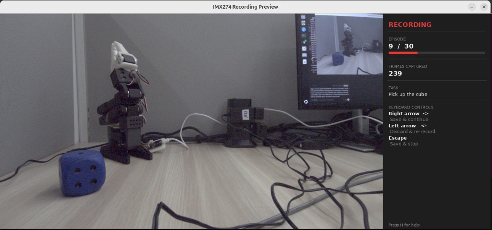

# Reset Phase and GUI Panel Improvements
**Date:** 2026-04-18  
**Session goal:** Fix the reset phase to wait indefinitely for user input, surface the instructions inside the live preview GUI panel, and fix two separate box-sizing bugs.

---

## Preview window — screenshots

| Recording | Reset (waiting for → key) |
|---|---|
|  |  |

---

## 1. Reset phase no longer auto-advances

### Problem
After finishing an episode and pressing `→`, the script entered a "reset" state meant for repositioning the object and arm.  
The problem: the state had a hard countdown timer (`reset_time_s`, default 10 s). If the user wasn't fast enough, it would silently jump into recording the next episode without any action from the user.

### What was changed — `recording/imx274_lerobot_record.py`

**`reset_phase` function signature**  
Removed the `reset_time_s: float` parameter entirely.  
The loop condition changed from:
```python
while (time.perf_counter() - start_t) < reset_time_s:
```
to:
```python
while not events["exit_early"] and not events["stop_recording"]:
```
The loop now runs indefinitely. The only way to exit it is the user pressing:
- `→` — sets `events["exit_early"] = True`, proceeds to the next episode
- `ESC` — sets `events["stop_recording"] = True`, exits the whole recording session

**Terminal instructions printed on entry**  
When the script enters the reset phase it now prints a clearly bordered block:
```
  ┌─────────────────────────────────────────────────────┐
  │  RESET — reposition the object and the robot arm.   │
  │  Press  →  when ready to record the next episode.   │
  │  Press ESC to stop recording.                       │
  └─────────────────────────────────────────────────────┘
```

**Call site in `main()`**  
Removed the `reset_time_s=args.reset_time_s` argument from the `reset_phase(...)` call.  
Updated the log line from "Reset phase …" to "Reset phase: waiting for -> key …".

**`ArgumentParser`**  
Removed the `--reset-time` argument completely — it no longer has any effect.

**File header comment** updated from:
```
# After each episode there is a --reset-time second window to reset the scene.
```
to:
```
# After each episode the script waits in RESET state until → is pressed.
```

---

## 2. Reset instructions added to the live preview panel

### Problem
The terminal printed the reset instructions but the preview window showed nothing to indicate the user needed to act. The panel still showed generic "KEYBOARD CONTROLS" with the recording shortcuts, which was misleading.

### What was changed

A new section was added to `_build_panel()` in `imx274_lerobot_record.py`, rendered **only when `"reset" in phase_lower`**:

- A filled highlight box (dark amber background, yellow border) is drawn above the keyboard controls section.
- Inside the box, two lines are rendered:
  - **`PRESS  →  TO CONTINUE`** — bold, yellow
  - `Reposition object & arm first` — body size, dim grey
- The keyboard controls list below it is trimmed to only the two keys relevant during reset:
  - `Right arrow  ->` → `Start next episode`
  - `Escape` → `Save & stop`

  (The `Left arrow  <-  Discard & re-record` entry is hidden since re-recording isn't valid mid-reset.)

### Code note  
The `→` character is embedded as `"\u2192"` to ensure it renders cleanly through the Pillow TrueType font pipeline.

---

## 3. GUI highlight box height was too tight

### Problem
The yellow reset call-to-action box had `box_h = 46` hardcoded. With font line heights + top/bottom padding the two lines of text barely fit, with almost no breathing room and visible clipping on some display scales.

### Fix  
Replaced the magic number with computed constants:
```python
LINE1_H  = 16   # bold 13pt line height
LINE2_H  = 14   # body 13pt line height
V_PAD    = 10   # top and bottom inner padding
LINE_GAP =  4   # gap between the two text lines

box_h = V_PAD + LINE1_H + LINE_GAP + LINE2_H + V_PAD  # = 54
```
Text `y` positions are derived from the same constants, so text is always vertically centred inside the box regardless of future font size changes.

---

## 4. Terminal dataset menu box was too narrow

### Problem
The interactive dataset selection menu printed at startup uses box-drawing characters (`╔ ═ ╗ ║ ╚ ╝`) to frame the experiment descriptions.  
With `W = 66`, several description lines overflowed past the right `║` border because the content (including the 6-space indent prefix added by `row()`) was up to 74 characters wide.  
The longest offender: `"      " + "            generalise object selection without per-colour training."` = **74 chars**.

Negative `padding` values in `row()` silently produced no trailing spaces, so the closing `║` was appended immediately after the overflowing text, making the right border appear in the middle of a line.

### Fix
```python
# Before
W = 66
def row(s=""):
    padding = W - len(s)
    return "║" + s + " " * padding + "║"

# After
W = 76
def row(s=""):
    padding = max(0, W - len(s))
    return "║" + s + " " * padding + "║"
```
- `W = 76` gives 2 characters of margin beyond the longest known line (74).
- `max(0, ...)` is a safety guard so the right border always appears, even if a future line exceeds the box width.

---

## Summary of files changed this session

| File | Change |
|---|---|
| `recording/imx274_lerobot_record.py` | Reset phase waits indefinitely; terminal + GUI reset instructions; GUI box height fix; terminal menu box width fix |
